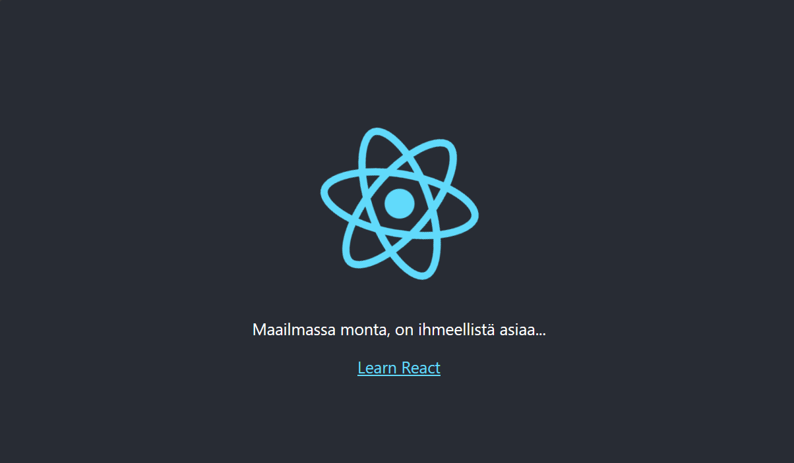

# perus_kauraa
peruskauraa on koulun kurssia varten tehty

## pienempi otsikko

### vähän vielä pienempi otsikko

#### viieelä vähän pienempi
| taulukko| jolla | on tietoja| 
| ---| --- | --- | 
| Tässä  | lukee tietoa | mitä sitten onkaan?| 

Koodia voidaan kirjoittaa näin: 

```javascript
var s = "JavaScript syntax highlighting";
alert(s);
```


## Hommahan liittyy Centrian kurssiin 
Ja sitä kautta tällä repolla ei ole mitään konkreettista sisältöä tai edes välttämättä konrkeettista koodia. 
Mutta koska tehtävän annossa piti tehdä repo, jossa verkkosivusto / koodia, niin tässä esimerkkinä react projekti. 

Tässä onkin kuvaa itse apin toiminnasta lokaalissa ympäristössä. 


